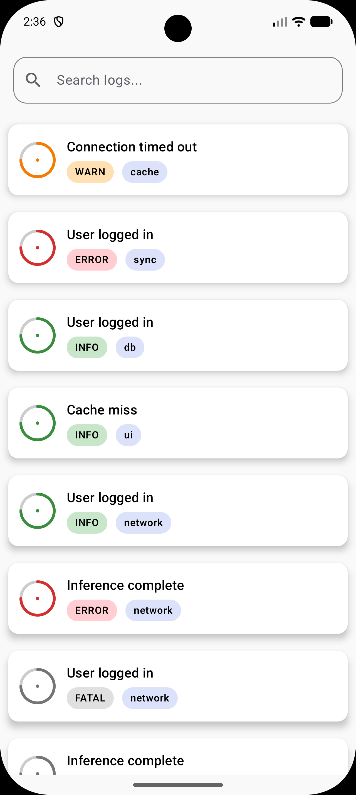
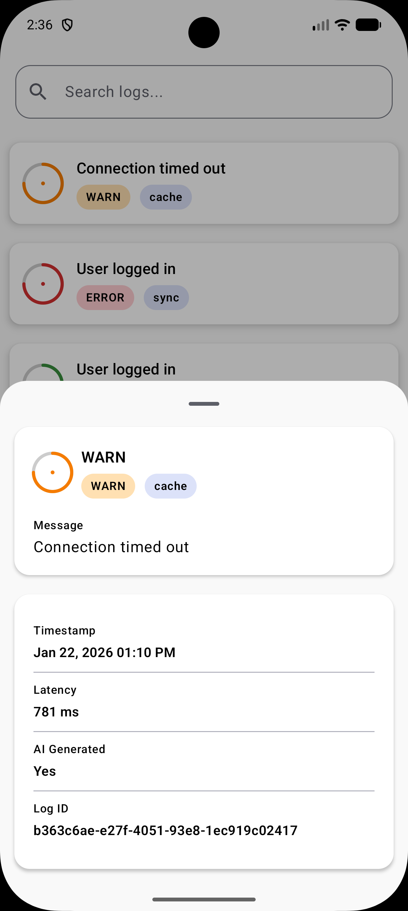
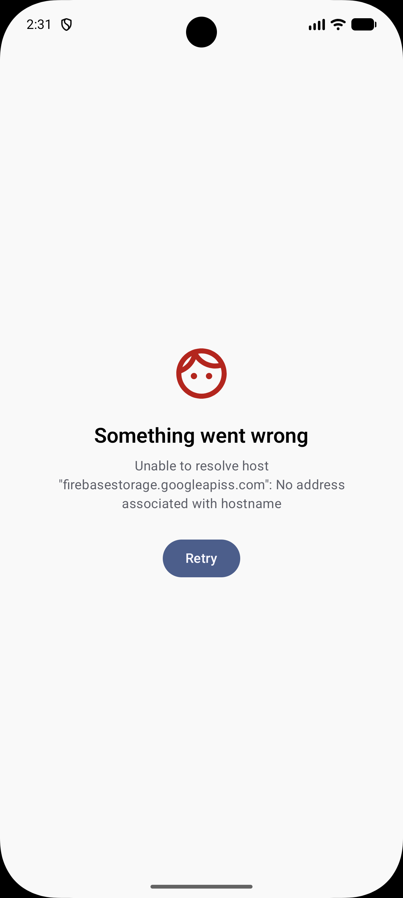
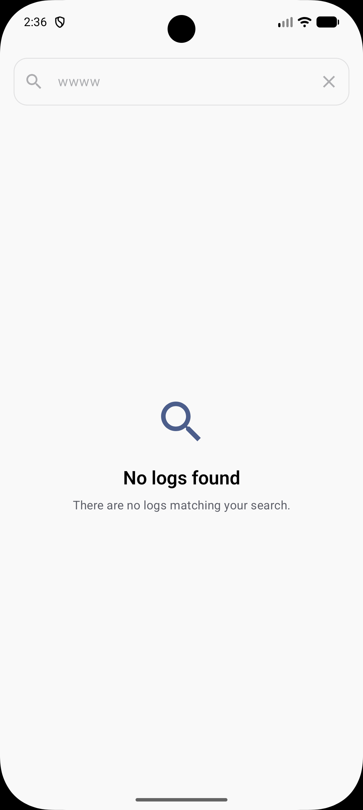
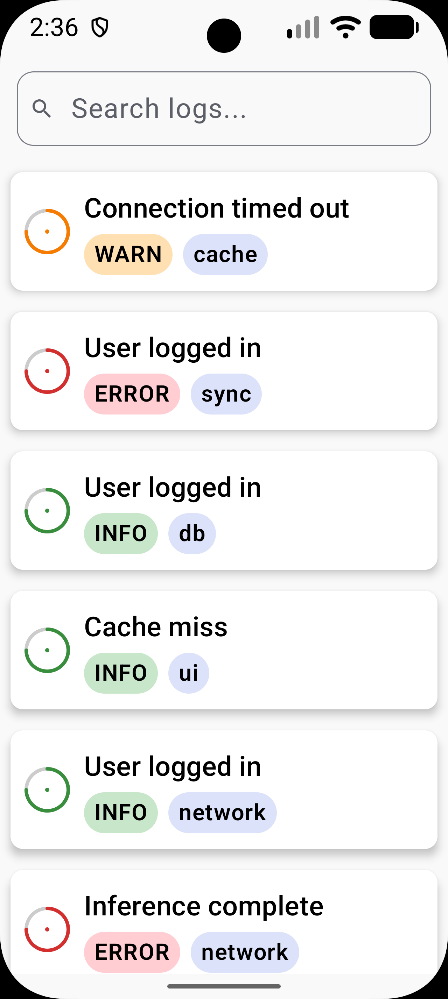
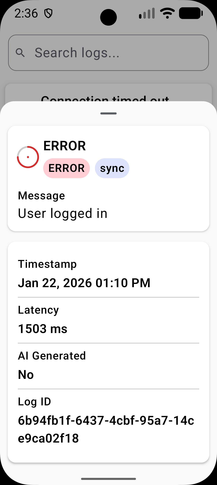
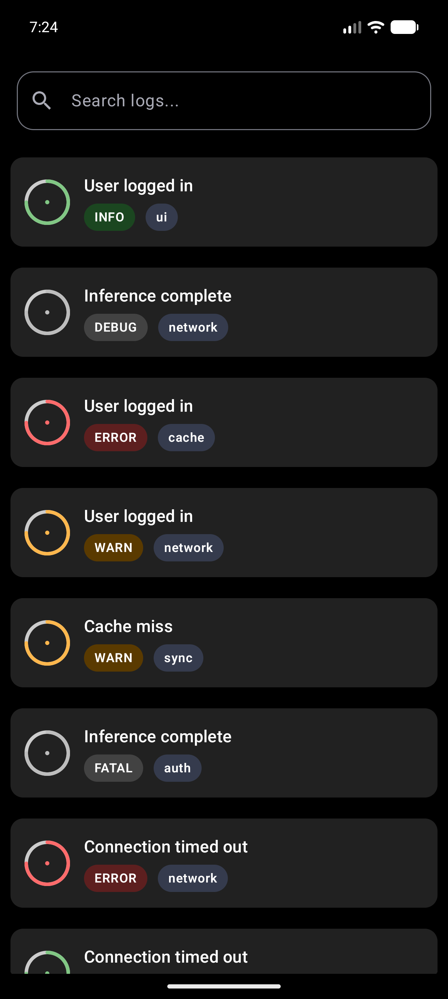
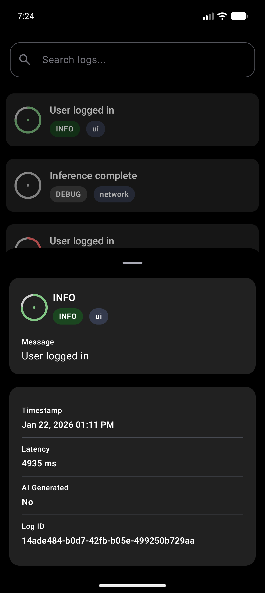
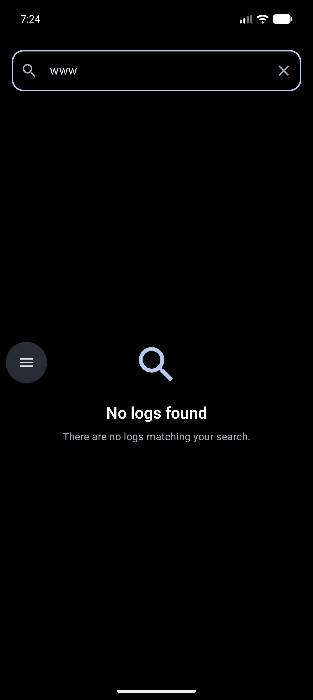
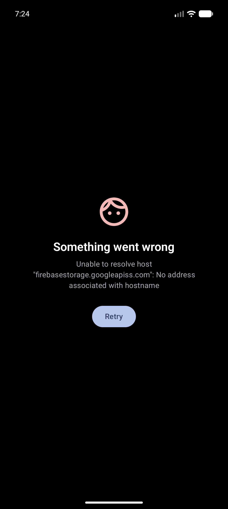

# AI Semantic Log Viewer

An Android application that fetches AI-generated semantic logs from a remote API, caches them locally using Room, and displays them using a modern Material 3 UI built with Jetpack Compose.

The application follows a layered Clean Architecture-inspired design with MVI for presentation state management and implements an **offline-first** data loading strategy.

---

## Features

- 📋 Display semantic logs in a smooth scrolling list
- 🔍 Search logs by:
  - Message
  - Tag
  - Severity
- 🎨 Custom severity indicator built using Compose Canvas
- 🏷️ Severity and tag chips for quick identification
- 📄 Bottom sheet displaying complete log details
- 💾 Offline-first architecture with Room caching
- 🔄 Automatic background refresh from the API
- ✨ Shimmer loading placeholders
- ⚠️ Error and empty state handling
- 🌙 Light and Dark theme support
- ♿ Dynamic font scaling support for improved accessibility

---

# Demo Videos

### Full App Walkthrough

- **Demo 1**
  - 

https://github.com/user-attachments/assets/a9f2356f-6c40-4dec-9341-1a99cab9d929


- **Demo 2**

https://github.com/user-attachments/assets/756a231a-31aa-43ba-b9d8-e4491fa598f5


---

# Screenshots

## Light Theme

| Log List | Log Details |
|-----------|-------------|
|  |  |

---

## Error & Empty States

| API Error / No Internet | No Logs Found |
|--------------------------|---------------|
|  |  |

---

## Dynamic Font Scaling

| Log List | Detail Bottom Sheet |
|----------|---------------------|
|  |  |

---

## Dark Theme

| Log List | Detail Bottom Sheet |
|----------|---------------------|
|  |  |

---

## Dark Theme States

| Empty State | API Error |
|-------------|-----------|
|  |  |

---

# Tech Stack

| Layer | Technologies |
|--------|--------------|
| UI | Jetpack Compose, Material 3 |
| Architecture | Clean Architecture (Layered), MVI |
| Dependency Injection | Hilt |
| Networking | Retrofit, Gson |
| Local Storage | Room |
| Asynchronous | Kotlin Coroutines, Flow |
| Testing | JUnit, MockK, Turbine, kotlinx-coroutines-test |

---

# Architecture

```
Presentation
──────────────────────────────────────────────
LogScreen
LogViewModel
LogIntent
LogState
        │
        ▼
Domain
──────────────────────────────────────────────
GetLogsUseCase
LogRepository
Log
        │
        ▼
Data
──────────────────────────────────────────────
LogRepositoryImpl
│
├── Retrofit
│     └── LogApiService
│
├── Room
│     ├── LogDao
│     └── AppDatabase
│
└── Mapper
      DTO ↔ Domain ↔ Entity
```

---

## Offline-First Data Flow

```
Application Launch
        │
        ▼
Read Cached Logs (Room)
        │
        ▼
Display Cached Data
        │
        ▼
Fetch Latest Logs (API)
        │
        ▼
Update Room Database
        │
        ▼
UI Automatically Updates
```

### Error Handling

- Cached data is displayed immediately when available.
- If the API request fails, cached data remains visible.
- An error message is shown only when no cached data exists.

---

# Project Structure

```
app/src/main/java/com/vimal/theaisemanticlog/

├── core/
│   └── util/
│       ├── DateUtils.kt
│       └── Extensions.kt
│
├── data/
│   ├── local/
│   │   ├── dao/
│   │   ├── database/
│   │   └── entity/
│   │
│   ├── mapper/
│   ├── remote/
│   │   ├── api/
│   │   ├── constants/
│   │   └── dto/
│   │
│   └── repository/
│
├── di/
│
├── domain/
│   ├── model/
│   ├── repository/
│   └── usecase/
│
├── presentation/
│   └── logs/
│       ├── LogIntent.kt
│       ├── LogState.kt
│       └── LogViewModel.kt
│
└── ui/
    └── log/
        ├── component/
        │   ├── common/
        │   │   ├── SeverityBadge.kt
        │   │   ├── SeverityIndicator.kt
        │   │   └── TagChip.kt
        │   ├── EmptyContent.kt
        │   ├── ErrorContent.kt
        │   ├── LogItem.kt
        │   └── LogItemShimmer.kt
        │
        ├── detail/
        │   └── LogDetailBottomSheet.kt
        │
        ├── extension/
        │   └── (UI extension functions)
        │
        ├── preview/
        │   └── (Compose previews)
        │
        └── LogScreen.kt
```

---

# Getting Started

## Prerequisites

- Android Studio Ladybug or newer
- JDK 11+
- Android SDK 36

---

## Setup

Clone the repository.

```bash
git clone https://github.com/VimalPatel14/AI-Semantic-Log.git
```

Open the project in Android Studio.

Sync Gradle dependencies.

Run the application.

### Minimum SDK

```
24
```

No API keys are required.

The application uses a public Firebase Storage endpoint configured in `ApiConstants`.

---

# Testing

Run all unit tests:

```bash
./gradlew test
```

### Current Test Coverage

| Component | Coverage |
|-----------|----------|
| LogViewModel | Loading, Success, Error, Search, Bottom Sheet |
| GetLogsUseCase | Success, Failure, Repository Delegation |
| LogRepositoryImpl | Cache → Remote Success, No Cache → Remote Success, Cache → API Failure (Fallback to Cache), No Cache → API Failure, Database Save Verification |

---

# Known Limitations

- No pagination - the complete dataset is loaded at once.

---

# AI-Assisted Development

AI tools were used to accelerate development, generate boilerplate code, explore implementation approaches, and assist with documentation.

All AI-generated code and suggestions were manually reviewed, modified where necessary, tested, and validated before being included in the project.

For complete transparency, see:

[**PROMPTS.md**](PROMPTS.md)

---

# License

This project is provided for demonstration and assessment purposes only.
